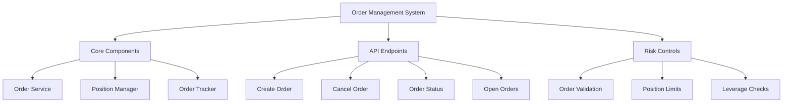
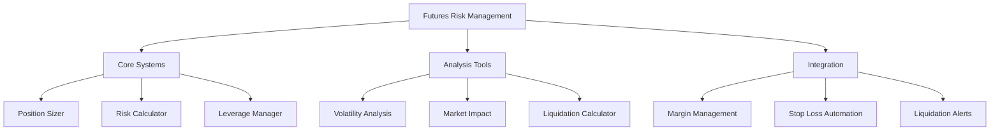
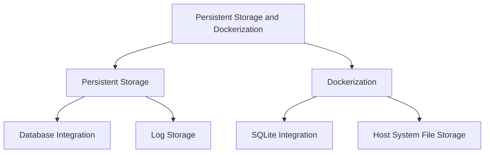
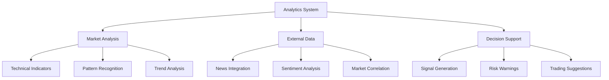

# Implementation Plan for Binance Futures MCP Server

This document outlines the implementation plan for a Model Context Protocol (MCP) server specifically designed for futures trading on Binance. The server provides a high-level interface for Language Models to interact with Binance's Futures API, handling complex futures trading operations, risk management, and market analysis.

## Key Features

- Futures-specific order management with leverage and margin controls
- Advanced risk management for futures positions
- Technical analysis tailored for futures market conditions
- Real-time position tracking and liquidation prevention

## Phase 1: Order Management System Implementation



1. **Order Service Implementation (1 week)**

   - Create `src/trading/order-service.ts`:

   ```typescript
   interface OrderService {
     createOrder(params: NewFuturesOrder): Promise<FuturesOrder>;
     cancelOrder(symbol: string, orderId: number): Promise<boolean>;
     getOrderStatus(symbol: string, orderId: number): Promise<FuturesOrder>;
     getOpenOrders(symbol?: string): Promise<FuturesOrder[]>;
   }
   ```

2. **Position Manager (3-4 days)**

   - Create `src/trading/position-manager.ts`:

   ```typescript
   interface PositionManager {
     getCurrentPosition(symbol: string): Promise<Position>;
     calculateMaxPosition(symbol: string): Promise<number>;
     validatePositionSize(symbol: string, size: number): Promise<boolean>;
     getPositionRisk(symbol: string): Promise<PositionRisk>;
   }
   ```

3. **Order Tracking System (3-4 days)**
   - Create `src/trading/order-tracker.ts`:
   ```typescript
   interface OrderTracker {
     trackOrder(order: FuturesOrder): void;
     updateOrderStatus(orderId: number, status: OrderStatus): void;
     getOrderHistory(symbol: string): OrderHistory[];
     subscribeToOrderUpdates(callback: OrderUpdateCallback): void;
   }
   ```

## Phase 2: Risk Management Implementation



1. **Futures Position Sizing System (1 week)**

   - Create `src/risk/position-sizer.ts`:

   ```typescript
   interface PositionSizer {
     calculatePositionSize(params: {
       symbol: string;
       riskAmount: number;
       stopLoss: number;
       leverage: number;
       marginType: "ISOLATED" | "CROSS";
     }): Promise<PositionSizeRecommendation>;

     validateRiskLevels(position: Position): RiskAssessment;
     getMaxPositionSize(params: {
       symbol: string;
       leverage: number;
       marginType: "ISOLATED" | "CROSS";
     }): Promise<number>;
   }
   ```

2. **Advanced Risk Calculator (4-5 days)**

   - Create `src/risk/risk-calculator.ts`:

   ```typescript
   interface RiskCalculator {
     calculatePositionRisk(position: Position): PositionRisk;
     assessPortfolioRisk(): PortfolioRisk;
     calculateOptimalLeverage(params: {
       symbol: string;
       targetRisk: number;
       marginType: "ISOLATED" | "CROSS";
     }): Promise<LeverageRecommendation>;
     calculateLiquidationPrice(params: {
       symbol: string;
       position: Position;
       leverage: number;
     }): Promise<number>;
     getVolatilityMetrics(symbol: string): VolatilityMetrics;
   }
   ```

## Phase 3: Persistent Storage and Dockerization



1. **Persistent Storage for Logs and Data (1 week)**

   - Integrate SQLite for persistent storage:

     - Create a database schema for storing logs and analysis data:

       ```sql
       CREATE TABLE logs (
           id INTEGER PRIMARY KEY AUTOINCREMENT,
           timestamp DATETIME DEFAULT CURRENT_TIMESTAMP,
           level TEXT,
           message TEXT,
           context TEXT
       );

       CREATE TABLE analysis_data (
           id INTEGER PRIMARY KEY AUTOINCREMENT,
           timestamp DATETIME DEFAULT CURRENT_TIMESTAMP,
           symbol TEXT,
           analysis_type TEXT,
           data TEXT
       );
       ```

   - Add a new module `src/storage/database.ts`:

     ```typescript
     import sqlite3 from "sqlite3";
     import { open } from "sqlite";

     export const initializeDatabase = async () => {
       const db = await open({
         filename: "./data/mcp_storage.db",
         driver: sqlite3.Database,
       });

       await db.exec(`
             CREATE TABLE IF NOT EXISTS logs (
                 id INTEGER PRIMARY KEY AUTOINCREMENT,
                 timestamp DATETIME DEFAULT CURRENT_TIMESTAMP,
                 level TEXT,
                 message TEXT,
                 context TEXT
             );
     
             CREATE TABLE IF NOT EXISTS analysis_data (
                 id INTEGER PRIMARY KEY AUTOINCREMENT,
                 timestamp DATETIME DEFAULT CURRENT_TIMESTAMP,
                 symbol TEXT,
                 analysis_type TEXT,
                 data TEXT
             );
         `);

       return db;
     };
     ```

   - Update services to log data into the database:
     - Modify `MarketSentimentAnalyzer` and other relevant services to store analysis results in the `analysis_data` table.
     - Add a logging utility to store logs in the `logs` table.

2. **Dockerization of MCP Server (1 week)**

   - Update the `Dockerfile` to include SQLite and configure persistent storage:

     ```dockerfile
     FROM node:16

     # Set working directory
     WORKDIR /app

     # Copy package files and install dependencies
     COPY package.json package-lock.json ./
     RUN npm install

     # Copy application code
     COPY . .

     # Install SQLite
     RUN apt-get update && apt-get install -y sqlite3

     # Expose application port
     EXPOSE 3000

     # Start the application
     CMD ["npm", "start"]
     ```

   - Add a volume to store SQLite database files on the host system:

     - Update `docker-compose.yml`:

       ```yaml
       version: "3.8"
       services:
         mcp:
           build: .
           ports:
             - "3000:3000"
           volumes:
             - ./data:/app/data
           environment:
             - NODE_ENV=production
       ```

   - Ensure the SQLite database is stored in the `./data` directory, which is mounted to the host system for persistence across container restarts.

## Phase 4: Advanced Analytics Implementation



1. **Technical Analysis Service (1-2 weeks)**

   - Create `src/analysis/technical-indicators.ts`:

   ```typescript
   interface TechnicalAnalysis {
     calculateMovingAverages(symbol: string, period: number): Promise<MAData>;
     calculateRSI(symbol: string): Promise<RSIData>;
     identifyPatterns(symbol: string): Promise<TradingPatterns>;
     getTrendStrength(symbol: string): Promise<TrendStrength>;
   }
   ```

2. **Market Context Integration (1 week)**
   - Create `src/analysis/market-context.ts`:
   ```typescript
   interface MarketContext {
     getMarketSentiment(symbol: string): Promise<SentimentData>;
     analyzeNewsImpact(symbol: string): Promise<NewsImpact>;
     getCorrelatedAssets(symbol: string): Promise<CorrelationData>;
   }
   ```

## Phase 5: API and Documentation Updates

1. **New API Endpoints (3-4 days)**
   Add to existing API:

   ```typescript
   // Futures Order endpoints
   POST /futures/orders/create
   POST /futures/orders/cancel
   GET /futures/orders/status/:orderId
   GET /futures/orders/open

   // Position Management
   GET /futures/position/:symbol
   POST /futures/leverage
   POST /futures/margin-type
   GET /futures/liquidation-price

   // Risk management endpoints
   GET /futures/risk/position-size
   GET /futures/risk/analysis
   GET /futures/risk/optimal-leverage
   GET /futures/risk/margin-requirements

   // Analytics endpoints
   GET /futures/analytics/technical
   GET /futures/analytics/sentiment
   GET /futures/analytics/funding-rate
   GET /futures/analytics/open-interest
   ```

2. **Documentation Updates (2-3 days)**
   - Update API documentation with futures trading endpoints
   - Add futures-specific examples and use cases
   - Include leverage and margin management guidelines
   - Document position sizing and risk management recommendations
   - Add liquidation price calculation examples

## Implementation Order:

1. First Priority (2-3 weeks):

   - Order Management System
   - Basic Risk Controls
   - Position Manager

2. Second Priority (2 weeks):

   - Risk Management System
   - Position Sizing
   - Leverage Management

3. Third Priority (2-3 weeks):

   - Technical Analysis
   - Market Context Integration
   - Advanced Analytics

4. Final Priority (1 week):
   - Documentation
   - Testing and Integration
   - Performance Optimization
